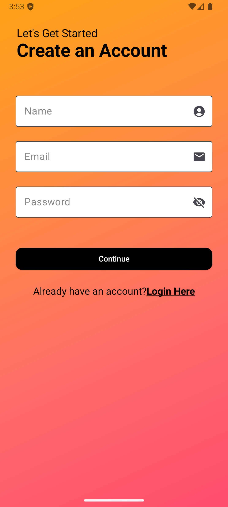

# Coderooms

**Coderooms** is a community-driven LeetCode companion app that categorizes users based on their LeetCode rating and connects them with similarly skilled peers. The app enables users to view their detailed LeetCode statistics and engage in group and personal discussions to collaboratively improve their problem-solving skills.

## 🚀 Features

### 📊 LeetCode Stats Integration
- Displays user's overall problem-solving stats:
  - Total number of problems solved
  - Breakdown by difficulty: Easy, Medium, Hard
- Shows the **10 most recently solved** questions with titles and timestamps.

### 🧠 Smart Grouping
- Automatically classifies users into **three groups** based on their LeetCode rating:
  - **Beginner**
  - **Intermediate**
  - **Advanced**
- Group classification helps match users with peers of similar skill levels.

### 💬 Group & Private Chat
- Group chat within each skill category to discuss problems, tips, and strategies.
- One-on-one personal chat with members from the same group for deeper collaboration.

## 📸 Screenshots

| **Login Screen** | **Signup Screen** |
|-------------------|-------------------|
|  |  |
| The login screen allows users to securely access their Coderooms account. | The signup screen enables new users to register and join the community where username is their Leetcode Profile username. |

| **Home Screen** | **User Stats Screen** |
|------------------|-----------------------|
|  |  |
| The home screen provides an overview of the app's features and navigation. | The user stats screen displays detailed LeetCode statistics, including problems solved and difficulty breakdown. |

| **Group Chat** | **Personal Chat** |
|----------------|-------------------|
|  |  |
| Group chat allows users to collaborate with peers in their skill category. | Personal chat enables one-on-one discussions for focused problem-solving. |

## 🧱 Tech Stack

- **Frontend:** Jetpack Compose
- **Backend:** Firebase Firestore & Firebase Auth
- **Architecture:** MVVM (Model View ViewModel)
- **LeetCode API:** Used to fetch user stats and problem history

## 🔧 Setup Instructions

1. **Clone the repo:**
   ```bash
   git clone https://github.com/rajvirsingh2/coderooms.git
   cd coderooms
